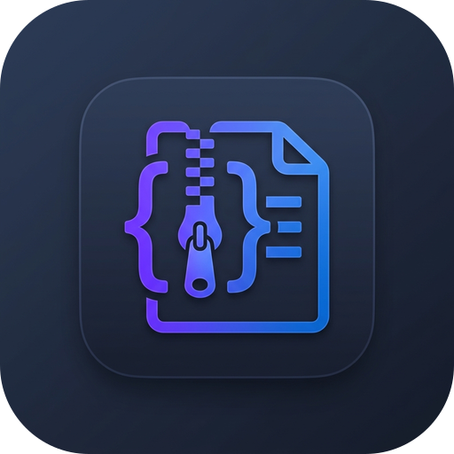

# ZipToTxt · AI Code Workspace (v3.1)

<p align="center">
  
</p>

<p align="center">
  <strong>专为大语言模型上下文吞吐与工程自动化设计的「代码仓库 ⇄ 单一 TXT ⇄ AI 代码补丁」双向工作台</strong>
</p>

<p align="center">
  
  
  
  
  
  
</p>

---

## 🌟 项目简介

在将完整工程源码提供给主流大语言模型（如 Claude 3.5 Sonnet、GPT-4o、Gemini 1.5 Pro/Flash、DeepSeek-V3/R1 等）进行跨文件重构与开发时，开发者常面临 **“多文件上传琐碎”、“文件层级与排版混乱”、“Token 预算不可预估”** 以及 **“AI 返回修改后难以批量合并回本地项目”** 的核心痛点。

**ZipToTxt** 提供了完整的全链路双向开发闭环：
1. **正向导出（ZIP → 结构化 TXT）**：将任意仓库 ZIP 压缩包一键解析为包含 **ASCII 目录树、多语言代码正文、二进制哈希/Base64** 的结构化上下文，自动装配多模型 Token 预算及系统提示词。
2. **反向打补丁（AI Markdown → Patch ZIP）**：智能提取 AI 返回的标准 Markdown 代码块，支持自动修复截断代码围栏，提供可视化行级 Diff 审查与敏感凭证隔离，一键打包为可直接解压覆盖的 `patch.zip`。

项目同时提供 **高性能 Web 端工作台** 与 **Windows 原生单文件客户端（`ZipToTxt.exe`）**。

---

## 🔄 7 步端到端开发闭环

```text
[1. 选择项目] ──> [2. 分析项目] ──> [3. 生成上下文] ──> [4. 交付 AI 交互]
   (ZIP 拖入)     (目录树/Token)    (Prompt + 源码)     (大模型编程)
                                                            │
[7. 导出 Patch] <── [6. 审查 Diff] <── [5. 导入结果] <──────┘
 (生成补丁 ZIP)     (行级差异比对)     (粘贴 Markdown)
```

---

## ✨ 核心特性

### 1. 📦 正向导出：仓库 ZIP → 结构化 TXT
- **拖拽解析与根目录自适应**：支持直接拖拽任意 `.zip` 文件，自动识别并跳过 GitHub 导出的单一根目录前缀。
- **ASCII 项目结构树**：自动生成清晰的目录树图谱，帮助大模型建立完整全局文件索引。
- **智能文本与二进制分流**：内置 60+ 种常用编程语言扩展名与配置白名单，精准识别 UTF-8/GBK 文本文件；二进制文件自动提取 SHA-256 校验和（支持一键开启 Base64 嵌入）。
- **多模型 Token 预算测算**：实时测算并对比 GPT-4o、Claude 3.5 Sonnet、DeepSeek 及 Gemini 的 Token 开销与费用估算。
- **系统提示词自动装配**：内置全库重构、零缺陷安全审计与截断续写等生产级 Prompt 模板。

### 2. 🧩 反向导入：AI Markdown → 补丁 ZIP
- **宽容代码块解析器**：精准提取形如 `### FILE: path/to/file.ext` 的代码块，支持兼容多种 AI 标头格式。
- **截断代码自动修复**：当 AI 因上下文达到上限未闭合代码块时，自动闭合代码围栏并提供续写指令。
- **行级 Diff 可视化审查**：直观展示新增 (`+`)、修改 (`~`) 和未变更状态，避免遗漏改动。
- **精确补丁打包**：仅将变更文件按原工程目录结构打包为 `patch.zip`，杜绝未修改文件的无效覆盖。

### 3. 🛡️ 工业级安全沙箱与防御机制
- **Zip Slip 路径逃逸防御**：严格阻断 `..`、`%2e%2e`、绝对路径 (`/etc/passwd`, `C:\`) 及 UNC 网络共享路径 (`\\server\share`)。
- **Windows 保留设备名过滤**：自动过滤 `CON`、`PRN`、`AUX`、`NUL`、`COM1-9`、`LPT1-9` 及相关后缀，防止 Windows 文件系统锁死。
- **Unicode Trojan Source 清洗**：剥离双向文本覆盖字符 (`\u202A-\u202E`) 与零宽隐形字符。
- **敏感凭证安全隔离**：默认识别并隔离 `.env`、`id_rsa`、`.pem`、云凭据与 `.git` 内部对象，防止意外打包外泄。
- **100% 浏览器本地私密沙箱**：纯客户端前端运算，无任何源码或代码上传至外部服务器。

---

## 🖥️ 两种使用形态

### 方式 A：Web 工作台（在线 / 本地）
基于 **React 18 + TypeScript + Tailwind CSS + Monaco Editor + JSZip** 构建。

#### 本地启动 Web 端
```bash
# 1. 安装依赖
npm install

# 2. 启动开发服务器
npm run dev

# 3. 生产打包
npm run build
```

---

### 方式 B：Windows 原生桌面客户端（`ZipToTxt.exe`）
基于 **Python 3.10+ / PySide6 (Qt6)** 构建，支持浅色/深色主题切换、多线程文件处理与原生拖拽。

#### 客户端源码运行
```bash
# 1. 安装依赖
pip install -r requirements.txt

# 2. 启动桌面客户端
python main.py
```

#### 本地编译单文件 EXE
```bash
# 1. 安装 PyInstaller
pip install pyinstaller==6.22.2

# 2. 执行单文件打包命令
pyinstaller --clean --noconfirm `
  --onefile `
  --windowed `
  --name "ZipToTxt" `
  --icon="app.ico" `
  --add-data "app.ico;." `
  --add-data "app_icon.png;." `
  main.py
```
打包输出路径位于 `dist/ZipToTxt.exe`。

---

## 🤖 推荐 AI 交互提示词规范

为确保大模型生成的代码可被 100% 精准识别并自动打补丁，建议使用以下标准输出格式：

### 推荐 Prompt 模板
```markdown
我正在与你共享一个由 ZipToTxt 导出的完整项目仓库上下文 TXT。

请帮我实现以下需求：
[在此详细描述您的业务需求、Bug 修复或功能重构]

【输出规范】：
1. 保持项目现有架构与目录规范；
2. 仅输出你修改过或新创建的文件；
3. 禁止输出省略号（如 // ... 其余代码不变），必须输出完整可运行的文件代码；
4. 每个文件前必须且仅能使用以下 Markdown 标头：

### FILE: relative/path/to/file.ext
```language
// 完整的文件内容
```
```

---

## 📦 如何发布新版本与自动打包 Release (GitHub Actions)

项目配置了完整的自动化构建与发布工作流（位于 `.github/workflows/build.yml`）。

### 为什么在 GitHub 创建 Release 后没有自动打包？
通常是因为以下两个原因：
1. **GitHub 仓库权限未开启写权限**：
   - 进入你的 GitHub 仓库 → **Settings** → **Actions** → **General**。
   - 向下滚动找到 **Workflow permissions**。
   - 将默认的 *"Read repository contents permission"* 改选为 **"Read and write permissions"**，并点击 **Save**。
2. **Tag 命名规则**：
   - 之前的工作流仅匹配以 `v` 开头的标签（如 `v3.1.0`）。如果创建的标签为 `3.1.0`（未带 `v`），则无法触发构建。
   - 当前工作流已升级为**支持任意 Tag 格式**以及 **GitHub Release 发布事件（`release: published`）**。

### 标准发布步骤

#### 方式 1：通过 Git 命令行推送 Tag（推荐）
```bash
# 1. 确保所有修改已提交并推送到 main 分支
git add .
git commit -m "Release v3.1.0"
git push origin main

# 2. 打标签并推送到 GitHub
git tag v3.1.0
git push origin v3.1.0
```
推送后，GitHub Actions 会自动启动 Windows 虚拟机打包 `ZipToTxt.exe`，并在编译通过后自动创建/更新 Release 并挂载 EXE 下载附件。

#### 方式 2：在 GitHub 网页端发布 Release
1. 打开 GitHub 仓库页面，点击右侧的 **Releases** → **Draft a new release**。
2. 点击 **Choose a tag**，输入版本号（例如 `v3.1.0`），选择 **Create new tag: v3.1.0 on publish**。
3. 填写 Release 标题与版本描述。
4. 点击 **Publish release**。
5. 切换到 **Actions** 标签页即可看到正在自动构建的 `Build and Release Windows EXE` 任务。构建完成后，`ZipToTxt.exe` 会自动挂载到该 Release 的 Assets 列表中供所有人下载。

---

## 📁 项目目录结构

```text
├── .github/workflows/
│   └── build.yml             # GitHub Actions 自动化构建与 Release 脚本
├── public/
│   ├── app-icon.png          # 现代高清应用图标 (PNG)
│   ├── app-icon.ico          # Windows 多分辨率系统图标 (ICO)
│   └── favicon.ico           # Web 网页 Favicon
├── src/
│   ├── assets/               # 矢量图形与静态资源
│   ├── components/
│   │   ├── convert/          # 项目转换子模块
│   │   │   ├── ZipDropZone.tsx         # ZIP 拖拽上传与文件选择
│   │   │   ├── ProjectStatsSummary.tsx # 项目核心指标概览与快捷导出
│   │   │   ├── PromptComposerTab.tsx   # 提示词装配器与自定义注入
│   │   │   ├── FileTreeViewerTab.tsx   # ASCII 树与文件检索表格
│   │   │   ├── TokenBudgetTab.tsx      # 多模型 Token 预算测算卡片
│   │   │   ├── FilePreviewModal.tsx    # 文件内容预览弹窗
│   │   │   └── PromptEditorModal.tsx   # 提示词查看与编辑弹窗
│   │   ├── Dashboard.tsx     # 控制台首页 (7步工作流与项目通道)
│   │   ├── ConvertPage.tsx   # 01 · 仓库转 TXT 转换页
│   │   ├── PatchPage.tsx     # 02 · AI 补丁解析与 Diff 审查页
│   │   ├── DiffViewer.tsx    # 行级代码差异比对组件
│   │   ├── SecurityAuditPage.tsx # 03 · 安全架构审计与沙箱测试页
│   │   ├── HelpPage.tsx      # 04 · 开发指南与提示词库
│   │   └── Sidebar.tsx       # 全局侧边栏导航组件
│   ├── utils/
│   │   ├── zipToTxt.ts       # Web 端 ZIP 解压、树生成与代码序列化
│   │   ├── aiParser.ts       # 宽容 Markdown 解析器与代码块提取
│   │   ├── security.ts       # Zip Slip 与敏感路径安全校验
│   │   ├── tokenEstimator.ts # GPT/Claude/DeepSeek Token 估算器
│   │   └── constants.ts      # 默认提示词模板与系统配额常量
│   ├── types.ts              # 全局 TypeScript 接口定义
│   ├── App.tsx               # Web 端顶层应用组件
│   └── main.tsx              # React DOM 渲染入口
├── core.py                   # Python 核心解析与安全审计引擎 (CLI/GUI 共用)
├── main.py                   # Python PySide6 (Qt6) Windows 桌面端客户端
├── test_core.py              # Python 单元测试套件 (ZipSlip/ZipBomb/Parser 安全审计)
├── requirements.txt          # Python 依赖清单 (PySide6)
├── package.json              # Node.js / React 依赖与脚本配置
└── README.md                 # 项目详细中英文技术文档
```

---

## 🗑️ 彻底卸载与一键清理 (Uninstall & Clean up)

本工具遵循 **100% 绿色便携 (Portable) 与隐私安全规范**，不注入任何系统服务、不写入 Windows 注册表、不产生常驻后台进程。

### 1. 桌面端单文件客户端 (`ZipToTxt.exe`) 一键卸载
- **最简单方法**：直接在资源管理器中选中 `ZipToTxt.exe`，按 `Shift + Delete` 永久删除即可，无任何安装残留。
- **清理 PyInstaller 运行时解压临时缓存（可选）**：
  在 Windows PowerShell 中执行以下单行命令即可彻底清除临时运行文件：
  ```powershell
  Remove-Item -Path "$env:TEMP\_MEI*" -Recurse -Force -ErrorAction SilentlyContinue
  ```

---

### 2. 开发者源码与编译产物一键清理

如果您克隆了源码并进行过本地运行或编译，可通过以下命令一键清理所有依赖库（`node_modules`）、打包产物（`dist` / `build`）与 Python 字节码：

#### Windows (PowerShell 一键清理脚本)
```powershell
# 清理前端依赖与编译输出
Remove-Item -Recurse -Force dist, build, node_modules, .vite -ErrorAction SilentlyContinue

# 清理 Python 编译字节码与打包规格文件
Get-ChildItem -Path . -Include __pycache__, *.pyc, *.spec -Recurse | Remove-Item -Recurse -Force -ErrorAction SilentlyContinue

Write-Host "✅ ZipToTxt 本地编译缓存与依赖已全部清理完毕！" -ForegroundColor Green
```

#### Linux / macOS (Bash 一键清理命令)
```bash
# 一键清理所有打包产物与缓存
rm -rf dist/ build/ node_modules/ .vite/ *.spec
find . -type d -name "__pycache__" -exec rm -rf {} +
find . -type f -name "*.pyc" -delete

echo "✅ ZipToTxt 本地编译缓存与依赖已全部清理完毕！"
```

#### 彻底删除整个项目
如需彻底从硬盘移除整个项目，直接删除项目根目录即可：
```bash
# Windows PowerShell (退出当前目录后删除)
cd .. ; Remove-Item -Path "ZipToTxt" -Recurse -Force

# Linux / macOS
cd .. && rm -rf ZipToTxt
```

---

## 📄 开源许可证

本项目基于 [MIT License](LICENSE) 协议开源。欢迎提交 Issue 或 Pull Request！
